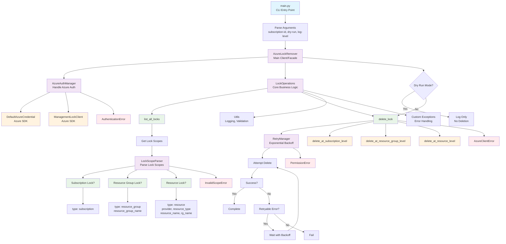

# Azure Lock Remover - Code Architecture

## Overview

The Azure Lock Remover has been refactored from a single 400-line file into a modular, maintainable package with clear separation of concerns.

## File Structure

```
src/
├── main.py                              # Main entry point (87 lines)
├── main_old.py                          # Original single-file version (backup)
└── azure_lock_remover/                  # Main package
    ├── __init__.py                      # Package initialization (16 lines)
    ├── auth.py                          # Azure authentication (52 lines)
    ├── client.py                        # Main client class (40 lines)
    ├── exceptions.py                    # Custom exceptions (25 lines)
    ├── operations.py                    # Lock operations (150 lines)
    ├── parser.py                        # Lock scope parsing (90 lines)
    ├── retry.py                         # Retry logic (50 lines)
    └── utils.py                         # Utilities (28 lines)
```

## Module Responsibilities

### 1. `main.py` (87 lines)
**Purpose**: Entry point and CLI handling
- Command-line argument parsing
- Main execution flow
- Error handling and user feedback
- Minimal business logic

### 2. `azure_lock_remover/auth.py` (52 lines)
**Purpose**: Azure authentication and client management
- `AzureAuthManager` class
- DefaultAzureCredential handling
- Client initialization
- Authentication error handling

### 3. `azure_lock_remover/client.py` (40 lines)
**Purpose**: Main API interface
- `AzureLockRemover` class (facade pattern)
- Simple public interface
- Coordinates between other components

### 4. `azure_lock_remover/operations.py` (150 lines)
**Purpose**: Core lock management operations
- `LockOperations` class
- List locks functionality
- Remove individual/all locks
- Business logic for lock removal

### 5. `azure_lock_remover/parser.py` (90 lines)
**Purpose**: Lock scope parsing logic
- `LockScopeParser` class
- Resource group vs resource vs subscription scope detection
- Robust parsing with proper error handling
- Extraction of Azure resource identifiers

### 6. `azure_lock_remover/retry.py` (50 lines)
**Purpose**: Retry logic with exponential backoff
- `RetryManager` class
- Configurable retry attempts
- Exponential backoff algorithm
- Azure-specific transient error handling

### 7. `azure_lock_remover/exceptions.py` (25 lines)
**Purpose**: Custom exception hierarchy
- `LockRemovalError` (base)
- `AuthenticationError`
- `InvalidScopeError`
- `AzureClientError`
- `PermissionError`

### 8. `azure_lock_remover/utils.py` (28 lines)
**Purpose**: Shared utilities
- Logging configuration
- Subscription ID validation
- Common helper functions

## Benefits of Refactoring

### ✅ **Maintainability**
- Each module has a single responsibility
- Easy to locate and fix bugs
- Clear separation of concerns

### ✅ **Testability**
- Each component can be unit tested independently
- Mock dependencies easily
- Better test coverage

### ✅ **Reusability**
- Components can be reused in other projects
- `AzureLockRemover` class can be imported as a library
- Parser can be used standalone

### ✅ **Readability**
- Smaller, focused files
- Clear module purposes
- Better code organization

### ✅ **Extensibility**
- Easy to add new features
- Can extend authentication methods
- Can add new lock types or operations

## Key Design Patterns Used

### 1. **Facade Pattern**
`AzureLockRemover` provides a simple interface hiding complex subsystems.

### 2. **Single Responsibility Principle**
Each class/module has one reason to change.

### 3. **Dependency Injection**
Components accept dependencies rather than creating them.

### 4. **Strategy Pattern**
Different deletion strategies based on lock scope type.

### 5. **Error Handling Chain**
Structured exception hierarchy for different error types.

## Usage Examples

### As a CLI Tool
```bash
python src/main.py --subscription-id <sub-id> --dry-run
```

### As a Library
```python
from azure_lock_remover import AzureLockRemover

remover = AzureLockRemover(subscription_id="...", dry_run=True)
result = remover.remove_all_locks()
print(f"Processed {result['total']} locks")
```

### Individual Components
```python
from azure_lock_remover.auth import AzureAuthManager
from azure_lock_remover.parser import LockScopeParser

auth = AzureAuthManager("subscription-id")
parser = LockScopeParser()
scope_info = parser.parse_lock_scope("/subscriptions/.../resourcegroups/rg-name")
```

## Migration Notes

- **API Compatibility**: The main CLI interface remains identical
- **Functionality**: All original features preserved
- **Performance**: No performance impact, possibly slight improvement
- **Dependencies**: Same Azure SDK dependencies

## Future Enhancements Made Easy

With this modular structure, you can easily:
- Add support for new Azure authentication methods
- Implement different retry strategies
- Add lock filtering capabilities
- Support bulk operations from files
- Add progress bars or detailed reporting
- Implement lock backup/restore functionality

The refactored code maintains all the robustness and features of the original while providing a much more maintainable and extensible foundation.

## Architecture Flowchart


